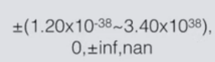

C语言中的变量
=

C中的变量有：

- char
- int
- long
- long long
- float
- float

每个变量都占有不同的字节数，可以使用sizeof来检查在计算中每个变量所占据的字节数

	#include<stdio.h>

	int main(int argc, char **argv){
    	printf("char = %ld\n",sizeof(char));
    	printf("int = %ld\n",sizeof(int));
    	printf("long = %ld\n",sizeof(long));
    	printf("long long = %ld\n",sizeof(long long));
    	printf("float = %ld\n",sizeof(float));
    	printf("float = %ld\n",sizeof(float));

    	return 0;
	}
	
1个字节= 8 位

CPU有32和64位是由计算机中各个存储器所使用的位数决定的。

32位也就是一个寄存器使用的是一个32位0，1串，64位也就是一个寄存器使用的是一个64位0，1串。其中64位在32位的基础上还多增加了一些寄存器。

寄存器存储的是微指令，微指令由指令和操作数构成。

寄存器的长度决定了Cpu 的指令长度和寻址能力。

指令长度越长，所能支持的指令越多，地址空间越长，所能访问的物理地址越多。

---

整型
=

在计算机内部整型都是使用的二进制编码。

1111 1111 这是表示是一个十进制的255，是一个8位二进制所能表示的最大的数字。

0000 0000 这个则是8位二进制所能表现的最小的数字。

在日常使用的数字中，会有正负数，-1、1 而二进制用来区分正负整数的时候用的就是`补码`，

[百度百科中补码的说明](http://baike.baidu.com/link?url=XHyEVmlC66NF12tDS7qPf_yyoeowz2_ZBICoyLvBWXLa2htvJaMLVdyw3jbpoWkkbdMgBLEZqs_XKR_Ce-P3E_)

十六进制转二进制，每个十六进制能表示4位的二进制数，所以十六进制与二进制可以很直观的转换。

1111 = F

1010 = A

	char c = 127;
	c+=1;
    printf("%d\n",c);	//-128
   

浮点型
=

浮点类型就是生活中习以为常的带小数点的数，但是在计算机内部，浮点数的处理是很特别的。整数是以二进制的形式存在于计算机内部的，而浮点数不是。浮点数是编码的数字，因此两个浮点数不能在计算机内部直接以二进制的方式进行计算，通常需要专门的硬件支持。

浮点数的计算机内部表达形式造成了浮点数的很多有意思的现象。

<table>
	<tr>
		<td>类型</td>
		<td>字长</td>
		<td>范围</td>
		<td>有效数字</td>
	</tr>
	<tr>
		<td>float</td>
		<td>32</td>
		<td></td>
		<td>7</td>
	</tr>
	<tr>
		<td>double</td>
		<td>64</td>
		<td></td>
		<td>15</td>
	</tr>
</table>

#### 超过范围的浮点数

printf输出`inf`表示超过范围的浮点数：正负无穷。

printf输出`nan`表示不存在的浮点数。

#### 浮点运算的精度

浮点数做计算的时候，结果并不想整型那么准确。如下例子

	#include<stdio.h>

	int main(int argc, char **argv){
  	  float a,b,c;
  	  a = 1.23f;
  	  b = 1.22f;
  	  c = a+b;
  	  if(c == 2.45)
  	      printf("相等\n");
  	  else
  	      printf("不相等\t%f\t%.10f\n",c,c);
  	  return 0;
	}
	
再给变量a和b赋值的时候，字面量1.23f、1.22f后面都带有`f`，因为默认带小数点字面量都是作为double类型而不是float类型的，所以必须用`f`来表示这是float类型的数字。

浮点数运算可以使用`math.h`头文件中的`fabs`函数来判断两个浮点型数是否相等。因为float表示会有误差，所以用两个数相减后在对比是否在误差范围内就可以判断两个浮点数是否相同。

上例中if语句可以修改为：

	if(fabs(c - 2.45) < 1E-18))
	
来判断就可以判断是否相等了.

